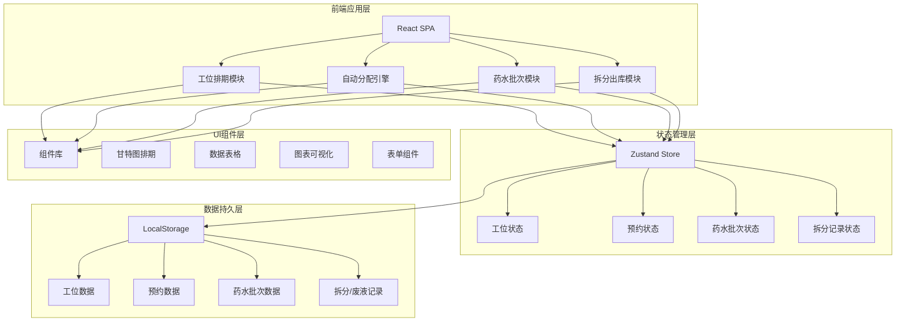
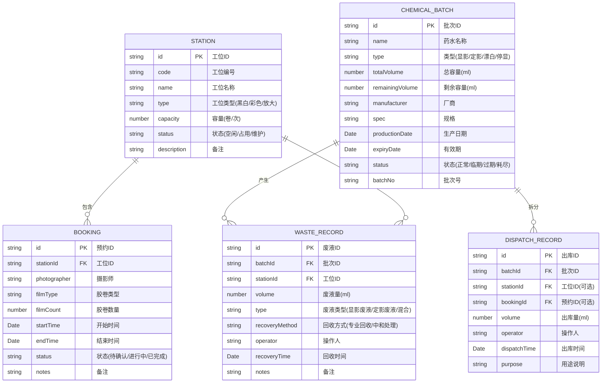

## 1. 架构设计



## 2. 技术描述

- **前端框架**：React@18 + TypeScript
- **构建工具**：Vite@5
- **样式方案**：TailwindCSS@3 + CSS Variables（主题系统）
- **状态管理**：Zustand@4（轻量级状态管理，支持持久化）
- **路由**：React Router DOM@6
- **图表可视化**：Recharts（折线图/柱状图/饼图）
- **日期处理**：date-fns
- **图标**：Lucide React（线性图标库）
- **数据持久化**：LocalStorage（纯前端，无后端）
- **后端**：无（纯前端应用，所有数据本地存储）
- **数据库**：LocalStorage + JSON序列化

## 3. 路由定义

| 路由 | 页面组件 | 用途 |
|------|----------|------|
| / | Dashboard | 数据概览仪表盘 |
| /stations | StationsPage | 工位排期看板 |
| /chemicals | ChemicalsPage | 药水批次管理 |
| /dispatch | DispatchPage | 拆分出库追踪 |
| /waste | WastePage | 废液回收记录 |

## 4. 数据模型

### 4.1 ER图



### 4.2 TypeScript 类型定义

```typescript
// 工位类型
export type StationType = 'black_white' | 'color' | 'enlarger' | 'mixed';
export type StationStatus = 'idle' | 'occupied' | 'maintenance';

export interface Station {
  id: string;
  code: string;
  name: string;
  type: StationType;
  capacity: number;
  status: StationStatus;
  description?: string;
  createdAt: string;
  updatedAt: string;
}

// 预约类型
export type BookingStatus = 'pending' | 'confirmed' | 'in_progress' | 'completed' | 'cancelled';

export interface Booking {
  id: string;
  stationId: string;
  photographer: string;
  filmType: string;
  filmCount: number;
  startTime: string;
  endTime: string;
  status: BookingStatus;
  notes?: string;
  createdAt: string;
  updatedAt: string;
}

// 药水类型
export type ChemicalType = 'developer' | 'fixer' | 'bleach' | 'stop_bath' | 'wetting_agent';
export type ChemicalStatus = 'normal' | 'near_expiry' | 'expired' | 'exhausted';

export interface ChemicalBatch {
  id: string;
  name: string;
  type: ChemicalType;
  totalVolume: number;
  remainingVolume: number;
  manufacturer: string;
  spec: string;
  productionDate: string;
  expiryDate: string;
  status: ChemicalStatus;
  batchNo: string;
  createdAt: string;
  updatedAt: string;
}

// 出库记录
export interface DispatchRecord {
  id: string;
  batchId: string;
  stationId?: string;
  bookingId?: string;
  volume: number;
  operator: string;
  dispatchTime: string;
  purpose: string;
  createdAt: string;
}

// 废液类型
export type WasteType = 'developer_waste' | 'fixer_waste' | 'bleach_waste' | 'mixed';
export type RecoveryMethod = 'professional' | 'neutralization' | 'storage';

export interface WasteRecord {
  id: string;
  batchId?: string;
  stationId?: string;
  volume: number;
  type: WasteType;
  recoveryMethod: RecoveryMethod;
  operator: string;
  recoveryTime: string;
  notes?: string;
  createdAt: string;
}
```

## 5. 核心算法

### 5.1 工位自动分配算法

```typescript
// 分配策略：碎片最少优先 + 负载均衡
// 1. 筛选所有满足时间段且状态正常的工位
// 2. 对每个工位计算空闲碎片评分（连续空闲块越大、碎片越少评分越高）
// 3. 计算工位7日负载率（已预约时长/可用时长）
// 4. 综合评分 = 碎片评分 * 0.6 + (1 - 负载率) * 0.4
// 5. 返回综合评分最高的工位
```

### 5.2 药水剩余量计算

```typescript
// remainingVolume = totalVolume - SUM(dispatchRecords.volume where batchId = current)
// 当 remainingVolume <= 100ml 时标记为临耗尽
// 当 expiryDate - now <= 7天 标记为临期
```
