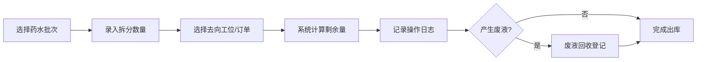

## 1. 产品概述

暗房冲洗工位管理系统是一款面向摄影工作室的纯前端应用，解决暗房工位资源调度碎片化和冲洗药水批次追踪难题。系统提供工位智能分配、负载均衡调度、药水批次拆分出库、剩余量追踪和废液回收记录等全流程管理。

- 目标用户：摄影工作室管理员、暗房技师、摄影师
- 核心价值：减少工位空闲碎片、精准追踪药水消耗、规范废液回收流程

## 2. 核心功能

### 2.1 用户角色

| 角色 | 核心权限 |
|------|----------|
| 管理员 | 工位建档、药水入库、系统配置、全功能操作 |
| 技师 | 查看排期、工位分配确认、药水拆分出库、废液回收登记 |
| 摄影师 | 提交使用预约、查看个人排期 |

### 2.2 功能模块

1. **工位排期看板**：工位资源建档、时间轴排期视图、实时状态监控
2. **自动分配引擎**：摄影师仅提交使用时段，系统智能择优分配空闲工位，避免碎片产生
3. **药水批次管理**：药水批次入库、属性记录、有效期管理、库存概览
4. **拆分出库追踪**：批次拆分为多次使用、每次拆分剩余量计算、去向分布记录、废液回收登记

### 2.3 页面详情

| 页面名称 | 模块名称 | 功能描述 |
|----------|----------|----------|
| 工位排期看板 | 工位列表 | 增删改查工位信息（编号、类型、容量、状态） |
| 工位排期看板 | 时间轴视图 | 甘特图式展示各工位占用时段，支持拖拽调整 |
| 工位排期看板 | 预约提交 | 摄影师选择时间段（不指定工位）提交冲洗需求 |
| 自动分配引擎 | 分配算法 | 从空闲工位择优分配：优先连续空闲块、负载均衡、避免碎片化 |
| 自动分配引擎 | 分配结果 | 展示分配建议，支持确认/调整/重新分配 |
| 药水批次管理 | 批次列表 | 展示所有药水批次（名称、类型、总量、剩余量、有效期、状态） |
| 药水批次管理 | 批次入库 | 新增药水批次，录入厂商、规格、生产日期、有效期等 |
| 拆分出库追踪 | 拆分操作 | 从批次中拆分指定量，关联工位/订单，记录操作人、时间 |
| 拆分出库追踪 | 剩余量追踪 | 实时计算批次剩余量，展示消耗趋势 |
| 拆分出库追踪 | 去向分布 | 可视化展示批次药水拆分到各工位/订单的分布情况 |
| 拆分出库追踪 | 废液回收 | 登记废液回收量、回收方式、处理记录 |

## 3. 核心流程

### 3.1 工位预约与自动分配流程

摄影师提交使用时间段 → 系统扫描所有工位空闲时段 → 筛选满足时长的连续空闲块 → 按碎片最少/负载均衡原则排序 → 推荐最优工位 → 确认分配 → 更新排期看板

### 3.2 药水拆分出库流程

选择药水批次 → 录入拆分数量 → 选择去向（工位/订单）→ 系统计算剩余量 → 记录操作日志 → 如需废液登记 → 完成出库

## 4. 用户界面设计

### 4.1 设计风格

- **主色调**：深琥珀色 #8B4513（暗房安全灯感）+ 炭黑色 #1a1a1a + 米白色 #f5f0e8
- **强调色**：朱砂红 #c0392b（警示）+ 墨绿 #2c5f2d（正常）+ 古铜金 #b8860b（高亮）
- **按钮风格**：圆角6px，微立体阴影，暗房安全灯红色光晕悬停效果
- **字体**：标题使用 "Noto Serif SC" 衬线体（专业感），正文使用 "JetBrains Mono" 等宽字体（数据可读性）
- **布局风格**：卡片式布局，顶部导航 + 侧边栏模块切换，时间轴采用甘特图样式
- **图标风格**：线性复古图标，暗房工具元素（烧杯、胶卷、放大机等）

### 4.2 页面设计概览

| 页面名称 | 模块名称 | UI元素 |
|----------|----------|--------|
| 工位排期看板 | 工位列表 | 卡片网格，状态色标（空闲墨绿/占用琥珀/维护红色） |
| 工位排期看板 | 时间轴视图 | 横向甘特图，时间刻度，色块占用条，悬停详情 |
| 工位排期看板 | 预约表单 | 下拉时段选择器，胶卷数量选择，备注输入 |
| 自动分配引擎 | 分配建议 | 高亮推荐工位，对比信息卡片，倒计时确认条 |
| 药水批次管理 | 批次列表 | 数据表格，进度条显示剩余量，有效期倒计时色标 |
| 药水批次管理 | 入库表单 | 分步表单，烧杯图标装饰，化学感渐变分隔线 |
| 拆分出库追踪 | 拆分操作 | 滑动式数量选择器，去向选择下拉树，实时剩余量计算动画 |
| 拆分出库追踪 | 去向分布 | 环形图/桑基图，颜色编码各去向占比 |
| 拆分出库追踪 | 废液回收 | 废液桶图标，回收量滑块，处理方式选择卡片 |

### 4.3 响应式

桌面端优先设计（≥1280px），支持平板端（≥768px）侧边栏折叠，移动端（≥375px）卡片堆叠布局，触摸优化的滑块和按钮。

### 4.4 视觉细节

- 背景：炭黑底色叠加细颗粒噪点纹理（暗房胶片质感）
- 卡片：琥珀色微光边框，内阴影营造暗房安全灯氛围
- 动效：分配成功时红光脉冲动画，数据更新时数字滚动效果
- 装饰：暗房工具剪影装饰边角，胶卷穿孔图案作为分隔元素
